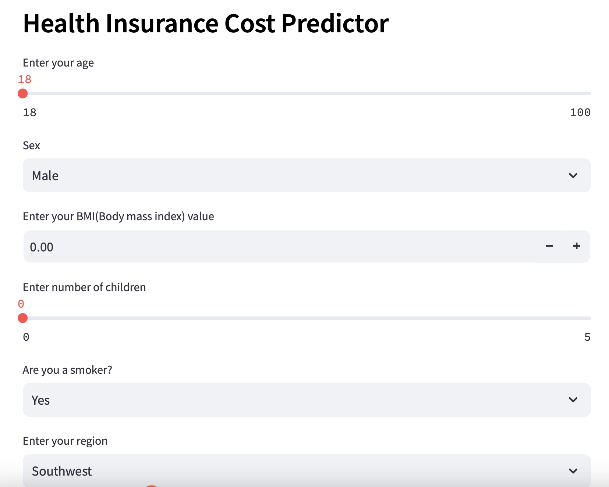
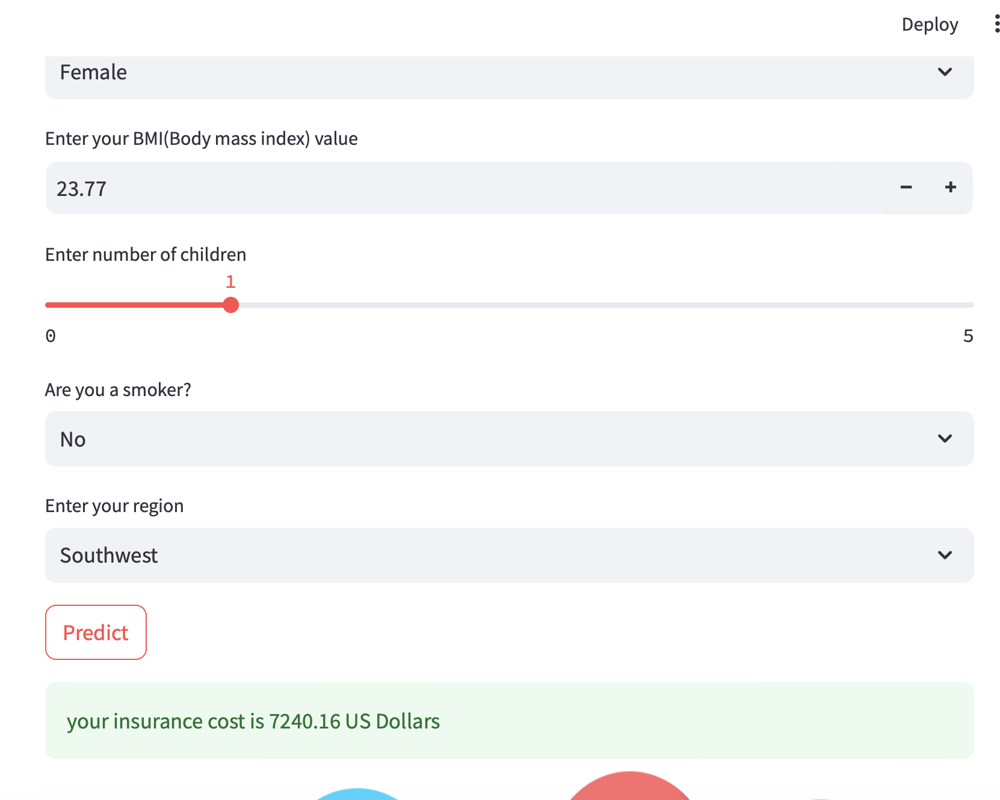

# Health Insurance Cost Prediction

A machine learning application to predict health insurance costs based on individual attributes. This project is built with Python and deployed using Streamlit.

## Table of Contents
- [Introduction](#introduction)
- [Features](#features)
- [Installation](#installation)
- [Usage](#usage)
- [Model Details](#model-details)
- [Technologies](#technologies)
- [Screenshots](#screenshots)
- [Contributing](#contributing)
- [License](#license)
- [Contact](#contact)

## Introduction
This repository contains a health insurance cost prediction application. Users can input personal details such as age, gender, BMI, number of children, smoking status, and geographic region to receive an estimated insurance cost.

## Features
- User input fields for:
  - Age
  - Gender
  - BMI (Body Mass Index)
  - Number of Children
  - Smoking Status
  - Geographic Region
- Real-time prediction of health insurance costs
- Interactive web interface built with Streamlit

## Installation
To run this application locally, follow these steps:

1. **Clone the repository:**
   ```bash
   https://github.com/aleenababy/health-insurance-cost-prediction.git
   cd health-insurance-prediction
   ```

2. **Create a virtual environment:**
   ```bash
   python3 -m venv venv
   source venv/bin/activate  # On Windows, use `venv\Scripts\activate`
   ```

3. **Install the required packages:**
   ```bash
   pip install -r requirements.txt
   ```

4. **Run the Streamlit application:**
   ```bash
   streamlit run app.py
   ```

## Usage
1. Open your web browser and navigate to `http://localhost:8501` to access the application.
2. Enter the required personal information in the input fields.
3. Click the "Predict" button to see the estimated health insurance cost.

## Model Details
The data is taken from:https://www.kaggle.com/datasets/mirichoi0218/insurance. The prediction model is built using supervised learning techniques on a dataset containing health insurance information. Features considered in the model include age, gender, BMI, smoking status, number of children, and geographic region.

## Technologies
- **Python**: Core programming language used for the project.
- **Streamlit**: Framework for creating the web application.
- **scikit-learn**: Library for building the machine learning model.
- **pandas**: Used for data manipulation and analysis.
- **NumPy**: Used for numerical computations.

## Screenshots





## Contributing
Contributions are welcome! To contribute:

1. Fork the repository.
2. Create a new branch (`git checkout -b feature-branch`).
3. Make your changes.
4. Commit your changes (`git commit -m 'Add some feature'`).
5. Push to the branch (`git push origin feature-branch`).
6. Open a pull request.

Please ensure your code adheres to the project's coding standards and includes appropriate tests.

## License
This project is licensed under the MIT License. See the [LICENSE](LICENSE) file for more information.

## Contact
For questions or feedback, feel free to reach out:

- **Your Name**: [Dr. Aleena Baby](mailto:aleenababy839@gmail.com)
